# Hi there, I'm Cyb3r Kun

I am a **Software Developer** and **Hobbyist Digital Artist**.
I enjoy tinkering, solving problems, digital art, and building systems
and I Love learning new things.

---

## My Current Obsessions
### **[LuaLuxa](https://github.com/LuaLuxa)** - A Modular Lua Ecosystem featuring:
* **`lux`**: A robust Package manager written in **Rust**, built for declarative setup scripts and programmatic package installation directly inside Lua.   
* **Core companion libraries**: Designed to make automation and Os Configuration seamless.  
    	* **File System library** (Built with Rust)  
		* **OS library** (System, `proc`, and environment modules built with Rust)
### 🎭 **Linux-Native 3D Puppeteering (Godot)**
Behind the scenes, I'm building a 3D VTubing tracking solution from scratch in Godot (currently unnamed).
*   **The Goal:** A Linux-native puppeteering app that *just works*, offering deep customizability and advanced configuration.
*   **Tracking Support:**
    *   MediaPipe face, hand, and body tracking for high-fidelity webcam input.
    *   Native VMC (Virtual Motion Capture) protocol support.
    *   Planned integration for Android and iOS tracking apps.

### 💻 **Workflow & Dev Environment**
*   **Editor:** A highly customized **[Neovim](https://github.com/cyb3rkun/nvim)** configuration (`blink.cmp`, and custom Tree-sitter queries).
*   **OS & WM:** Arch Linux running Hyprland (Wayland).
*   **Hardware Setup:**
    *   **Keyboard:** A self-built **[Corne Split Keyboard](https://github.com/cyb3rkun/qmk_userspace)** running custom QMK firmware with low-profile Gateron mechanical switches.
    *   **Art Tech:** A Huion Kamvas Pro 13 tablet paired with **OpenTabletDriver** and **Krita** for sketching and character design on Linux.

---

## 📊 GitHub Stats

---

## 🌐 Connect With Me

[**DeviantArt**](https://deviantart.com/Cyb3r-Kun) | [**My Website**](https://cyb3rs.com)

*"Optimizing workflows, one dotfile and brush stroke at a time."*
